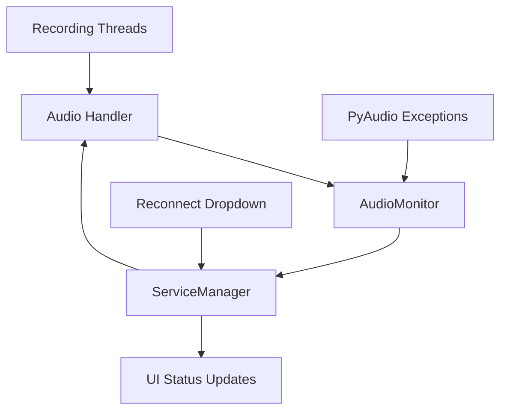

# Audio Resilience Design Document

## Overview

The audio resilience feature adds fault tolerance to the application by detecting audio device failures and automatically attempting to restore audio recording capability. The design integrates with the existing audio handling system and adds new components for audio device monitoring, error detection, and recovery orchestration.

The solution follows a layered approach similar to the browser reconnection system:
1. **Detection Layer**: Identifies audio device failures through exception handling
2. **Recovery Layer**: Manages reconnection attempts with exponential backoff
3. **Stream Management Layer**: Recreates audio streams when devices become available
4. **UI Layer**: Provides user feedback and manual controls

## Architecture

### Core Components

#### 1. AudioMonitor
A new class that monitors audio operations and detects device failures:
- Intercepts PyAudio exceptions
- Classifies errors as device-related or other failures
- Triggers recovery procedures when device failure is detected
- Maintains audio connection state tracking

#### 2. Enhanced Audio Handler
Extended to support device failure scenarios:
- Integrates with AudioMonitor for error detection
- Implements stream recreation logic when devices fail
- Provides graceful degradation during device unavailability
- Maintains recording thread resilience

#### 3. ServiceManager Integration
Enhanced to support audio resilience:
- Initializes AudioMonitor alongside PyAudio
- Coordinates audio reconnection attempts
- Manages audio device state across the application

#### 4. UI Integration
Updates to the reconnection system:
- Audio reconnection option in dropdown menu
- "Both" option for simultaneous browser and audio reconnection
- Enhanced status messages for audio-specific issues

### Component Interactions



## Components and Interfaces

### AudioMonitor Class

```python
class AudioMonitor:
    def __init__(self, service_manager, ui_controller):
        self.service_manager = service_manager
        self.ui_controller = ui_controller
        self.connection_state = AudioConnectionState.CONNECTED
        self.reconnection_history = []
        
    def is_audio_device_error(self, exception: Exception) -> bool:
        """Determines if an exception indicates audio device failure"""
        
    def handle_audio_error(self, source: str, exception: Exception):
        """Handles audio device errors by attempting reconnection"""
        
    def _attempt_audio_reconnection(self, source: str):
        """Attempts to reconnect audio device for specific source"""
```

### Enhanced Audio Handler Methods

```python
# In audio_handler.py
def recording_thread(source: str, mic_data: Dict, audio_queue: queue.Queue, 
                    audio: pyaudio.PyAudio, run_threads_ref: Dict, 
                    audio_monitor=None) -> None:
    # Enhanced with audio monitoring and stream recreation
    
def create_audio_stream():
    """Helper function to create audio stream with error handling"""
```

### ServiceManager Audio Extensions

```python
class ServiceManager:
    # Existing methods...
    
    def initialize_audio(self) -> bool:
        """Initialize PyAudio and AudioMonitor"""
        
    def start_services(self, audio_queue, transcribed_topics_queue) -> bool:
        """Start services with audio monitoring integration"""
```

## Data Models

### AudioConnectionState Enum
```python
from enum import Enum

class AudioConnectionState(Enum):
    CONNECTED = "connected"
    DISCONNECTED = "disconnected"
    RECONNECTING = "reconnecting"
    FAILED = "failed"
```

### AudioReconnectionAttempt DataClass
```python
@dataclass
class AudioReconnectionAttempt:
    attempt_number: int
    timestamp: datetime
    success: bool
    source: str  # "ME" or "OTHERS"
    error_message: Optional[str] = None
    delay_used: float = 0.0
```

## Error Handling

### Audio Device Error Detection
The system identifies audio device errors by examining exception types and messages:

1. **PyAudio Error Codes**:
   - `errno -9999`: Unanticipated host error
   - `errno -9988`: Stream closed
   - `errno -9996`: Invalid device
   - `errno -9986`: Device unavailable

2. **Common Error Messages**:
   - "stream closed"
   - "device unavailable"
   - "invalid device"
   - "unanticipated host error"

### Error Recovery Strategy

1. **Immediate Detection**: Catch exceptions during audio operations
2. **Stream Cleanup**: Safely close existing audio streams
3. **Device Testing**: Verify device availability before reconnection
4. **Stream Recreation**: Create new audio streams when devices are available
5. **Thread Resilience**: Maintain recording thread operation during failures

### Fallback Mechanisms

- If automatic reconnection fails, provide manual reconnection through UI dropdown
- If manual reconnection fails, display clear error message with device information
- Continue application operation even when audio devices are unavailable
- Graceful degradation: application remains functional without audio input

## UI Integration

### Reconnection Dropdown Enhancement

The existing reconnection dropdown is enhanced with audio options:
- **"Browser"**: Reconnect browser only
- **"Audio"**: Reconnect audio devices only  
- **"Both"**: Reconnect both browser and audio devices
- **Auto-reset**: Dropdown returns to default after selection

### Status Message Integration

Audio-specific status messages are integrated into the existing status system:
- Warning messages for device disconnection
- Progress messages during reconnection
- Success messages for restored devices
- Error messages for failed reconnection attempts

## Testing Strategy

### Unit Tests

1. **AudioMonitor Tests**
   - Test error classification logic for PyAudio exceptions
   - Verify proper audio device error handling
   - Test reconnection attempt management

2. **Audio Handler Integration Tests**
   - Test stream recreation logic
   - Verify recording thread resilience
   - Test audio monitoring integration

### Integration Tests

1. **End-to-End Audio Recovery**
   - Simulate device disconnection scenarios
   - Verify automatic recovery and stream recreation
   - Test manual reconnection through UI dropdown

2. **Multi-Device Scenarios**
   - Test failure and recovery of individual audio sources (ME/OTHERS)
   - Verify independent reconnection of different audio devices
   - Test simultaneous browser and audio reconnection

## Implementation Considerations

### Thread Safety
- All audio reconnection operations are performed on appropriate threads
- UI updates are dispatched to the main thread using `root.after()`
- Audio stream operations are protected during reconnection process

### Performance Impact
- Audio monitoring adds minimal overhead to recording operations
- Reconnection attempts use exponential backoff to avoid overwhelming the system
- Device testing is performed only when necessary, not continuously

### User Experience
- Clear, device-specific status messages throughout the process
- Minimal disruption to normal audio recording workflow
- Manual override option when automatic recovery fails
- Graceful degradation when devices are unavailable