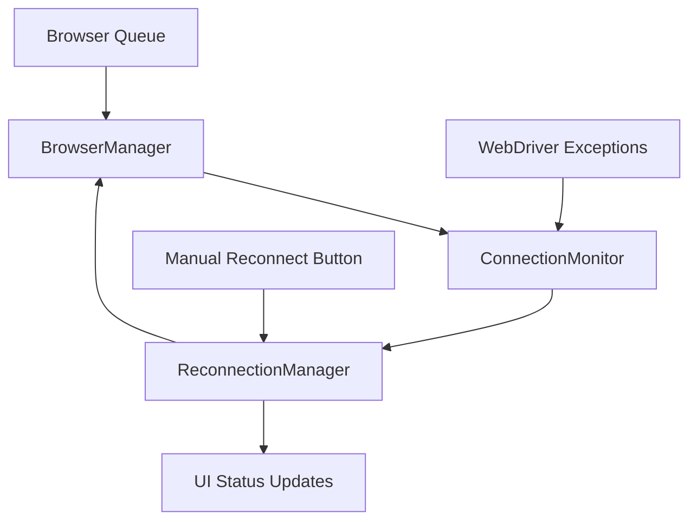

# Design Document

## Overview

The browser reconnection feature will add resilience to the application by detecting browser connection failures and automatically attempting to restore connectivity. The design integrates with the existing BrowserManager class and adds new components for connection monitoring, error detection, and recovery orchestration.

The solution follows a layered approach:
1. **Detection Layer**: Identifies connection loss through exception handling
2. **Recovery Layer**: Manages reconnection attempts with exponential backoff
3. **State Management Layer**: Preserves application state during reconnection
4. **UI Layer**: Provides user feedback and manual controls

## Architecture

### Core Components

#### 1. ConnectionMonitor
A new class that wraps browser operations and detects connection failures:
- Intercepts WebDriver exceptions
- Classifies errors as connection-related or other failures
- Triggers recovery procedures when connection loss is detected
- Maintains connection state tracking

#### 2. ReconnectionManager
Handles the reconnection logic with retry mechanisms:
- Implements exponential backoff strategy (1s, 2s, 4s delays)
- Manages reconnection attempts up to maximum retry limit
- Coordinates with BrowserManager for driver reinitialization
- Provides status callbacks to UI layer

#### 3. Enhanced BrowserManager
Extended to support reconnection scenarios:
- Adds connection health checking methods
- Implements graceful driver cleanup and reinitialization
- Preserves queue state during reconnection
- Integrates with ConnectionMonitor for error detection

#### 4. UI Enhancements
Updates to the status system and user controls:
- New status states for connection issues and recovery
- Manual reconnection button (always visible for user-initiated reconnection)
- Enhanced status messages with actionable information

### Component Interactions



## Components and Interfaces

### ConnectionMonitor Class

```python
class ConnectionMonitor:
    def __init__(self, browser_manager, ui_callback, reconnection_manager):
        self.browser_manager = browser_manager
        self.ui_callback = ui_callback
        self.reconnection_manager = reconnection_manager
        self.is_connected = True
        
    def execute_with_monitoring(self, operation, *args, **kwargs):
        """Wraps browser operations with connection monitoring"""
        
    def is_connection_error(self, exception) -> bool:
        """Determines if an exception indicates connection loss"""
        
    def handle_connection_loss(self):
        """Initiates recovery process when connection is lost"""
```

### ReconnectionManager Class

```python
class ReconnectionManager:
    def __init__(self, browser_manager, ui_callback):
        self.browser_manager = browser_manager
        self.ui_callback = ui_callback
        self.max_retries = 3
        self.base_delay = 1.0
        self.is_reconnecting = False
        
    def attempt_reconnection(self) -> bool:
        """Manages the full reconnection process with retries"""
        
    def reconnect_with_backoff(self) -> bool:
        """Implements exponential backoff reconnection strategy"""
        
    def restore_browser_state(self) -> bool:
        """Restores browser to ready state after reconnection"""
```

### Enhanced BrowserManager Methods

```python
class BrowserManager:
    # Existing methods...
    
    def cleanup_driver(self):
        """Safely cleanup existing driver connection"""
        
    def reinitialize_connection(self) -> bool:
        """Reinitialize driver and chat page after connection loss"""
        
    def test_connection_health(self) -> bool:
        """Test if current connection is healthy"""
        
    def preserve_queue_state(self):
        """Preserve pending queue items during reconnection"""
```

### UI Status Extensions

New status states added to the existing status system:
- `connection_lost`: Orange indicator, "Connection Lost - Attempting Reconnection..."
- `reconnecting`: Orange indicator, "Reconnecting to browser..."
- `reconnected`: Green indicator, "Reconnected - AI Ready"
- `connection_failed`: Red indicator, "Connection Failed - Manual reconnection required"

## Data Models

### ConnectionState Enum
```python
from enum import Enum

class ConnectionState(Enum):
    CONNECTED = "connected"
    DISCONNECTED = "disconnected"
    RECONNECTING = "reconnecting"
    FAILED = "failed"
```

### ReconnectionAttempt DataClass
```python
@dataclass
class ReconnectionAttempt:
    attempt_number: int
    timestamp: datetime
    success: bool
    error_message: Optional[str] = None
    delay_used: float = 0.0
```

## Error Handling

### Connection Error Detection
The system will identify connection errors by examining exception types and messages:

1. **WebDriverException** with messages containing:
   - "invalid session id"
   - "session deleted"
   - "browser has closed"
   - "not connected to DevTools"

2. **InvalidSessionIdException** (direct Selenium exception)

3. **Connection timeout** errors during browser operations

### Error Recovery Strategy

1. **Immediate Detection**: Catch exceptions during browser operations
2. **State Preservation**: Save current queue state and UI selections
3. **Cleanup**: Safely close existing driver connection
4. **Reconnection**: Attempt to establish new connection with retries
5. **State Restoration**: Restore browser to ready state and preserve queue
6. **UI Update**: Inform user of successful recovery or failure

### Fallback Mechanisms

- If automatic reconnection fails, provide manual reconnection button
- If manual reconnection fails, display clear error message with troubleshooting steps
- Preserve all topic data throughout the entire process
- Allow application to continue functioning in offline mode (topics can still be copied)

## Testing Strategy

### Unit Tests

1. **ConnectionMonitor Tests**
   - Test error classification logic
   - Verify proper exception handling
   - Test connection state tracking

2. **ReconnectionManager Tests**
   - Test retry logic with mocked failures
   - Verify exponential backoff timing
   - Test state preservation during reconnection

3. **BrowserManager Integration Tests**
   - Test driver cleanup and reinitialization
   - Verify queue state preservation
   - Test connection health checking

### Integration Tests

1. **End-to-End Reconnection Flow**
   - Simulate connection loss during topic submission
   - Verify automatic recovery and topic preservation
   - Test manual reconnection trigger

2. **UI Status Updates**
   - Verify correct status messages during each phase
   - Test manual reconnection button behavior
   - Validate status indicator colors

### Error Simulation Tests

1. **Connection Loss Scenarios**
   - Browser process termination
   - Network connectivity issues
   - Session timeout simulation

2. **Recovery Failure Scenarios**
   - Multiple failed reconnection attempts
   - Browser unavailable during recovery
   - Partial recovery states

## Implementation Considerations

### Thread Safety
- All reconnection operations will be performed on the browser communication thread
- UI updates will be dispatched to the main thread using `root.after()`
- Queue operations will be protected during reconnection process

### Performance Impact
- Connection monitoring adds minimal overhead to browser operations
- Reconnection attempts use exponential backoff to avoid overwhelming the system
- Health checks are performed only when necessary, not continuously

### Backward Compatibility
- All existing browser functionality remains unchanged
- New features are additive and don't modify existing interfaces
- Configuration options maintain default values for existing behavior

### User Experience
- Clear, actionable status messages throughout the process
- Preserved topic selections and queue state
- Manual override option when automatic recovery fails
- Minimal disruption to normal workflow