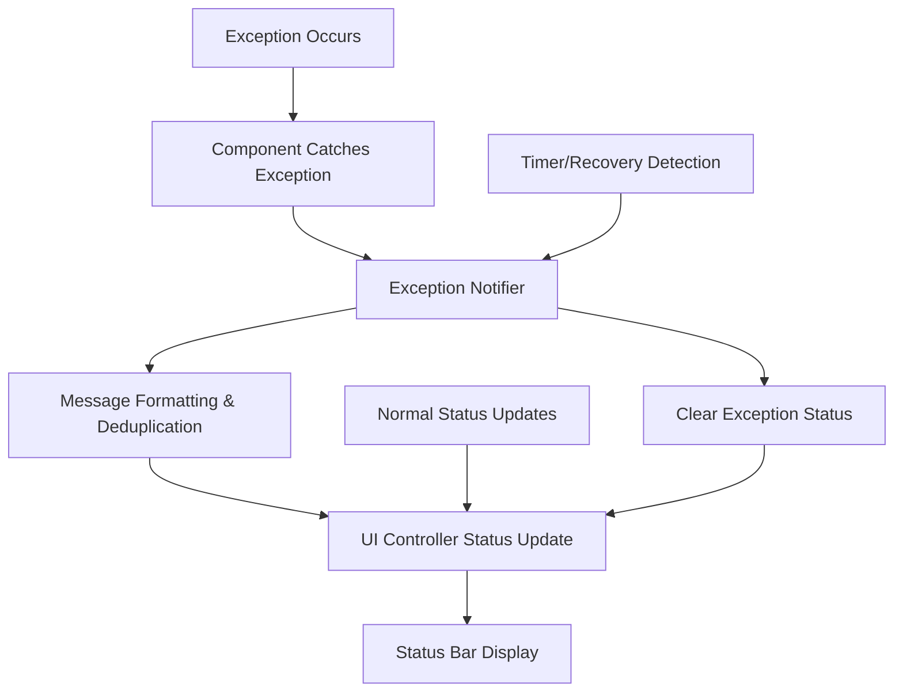

# Design Document

## Overview

The exception status notification system provides a centralized mechanism to surface critical exceptions to users through the existing UI status bar. The design leverages the current status update infrastructure while adding minimal complexity to the existing architecture.

The system focuses on two main exception categories:
1. **CUDA-related errors** in the transcription thread (primary use case)
2. **Audio device errors** in recording threads (secondary use case)

The design prioritizes minimal architectural changes by extending the existing status update mechanism rather than creating entirely new communication channels.

## Architecture

### Core Components

#### 1. Exception Notification Manager
A lightweight singleton class that manages exception notifications and integrates with the existing UI status system.

**Location**: New file `exception_notifier.py`

**Responsibilities**:
- Receive exception notifications from various components
- Categorize exceptions by type and severity
- Format user-friendly status messages
- Coordinate with UI status updates through existing channels
- Implement message deduplication and rate limiting

#### 2. Exception Detection Points
Integration points in existing components where exceptions are caught and reported.

**Primary Integration Points**:
- `transcription.py`: CUDA and general transcription errors
- `audio_handler.py`: Audio device and recording errors
- `audio_monitor.py`: Audio connection failures

#### 3. Status Message Routing
Extension of the existing status update mechanism to handle exception notifications.

**Integration Point**: 
- Existing `ui_controller.update_browser_status()` method
- New exception-specific status types in `ui_view.py`

### Communication Flow



## Components and Interfaces

### Exception Notifier Interface

```python
class ExceptionNotifier:
    def notify_exception(self, 
                        source: str, 
                        exception: Exception, 
                        severity: str = "error",
                        user_message: str = None) -> None
    
    def clear_exception_status(self, source: str) -> None
    
    def is_exception_active(self, source: str) -> bool
```

### Status Message Categories

**New Status Types** (added to existing `ui_view.py` status_colors):
- `cuda_error`: Red indicator for CUDA-related failures
- `audio_error`: Orange indicator for audio device failures  
- `transcription_error`: Red indicator for general transcription failures

### Integration Points

#### 1. Transcription Thread Integration
**File**: `transcription.py`
**Location**: Exception handling blocks in `transcription_thread()`

```python
# CUDA-specific error detection
if "cuda" in str(e).lower() or "gpu" in str(e).lower():
    exception_notifier.notify_exception("transcription", e, "error", 
                                      "CUDA Error - Transcription unavailable")
else:
    exception_notifier.notify_exception("transcription", e, "error",
                                      "Transcription Error")
```

#### 2. Audio Handler Integration  
**File**: `audio_handler.py`
**Location**: Exception handling in `recording_thread()`

```python
exception_notifier.notify_exception("audio_recording", e, "warning",
                                   f"Audio Recording Error - {source}")
```

#### 3. Audio Monitor Integration
**File**: `audio_monitor.py` 
**Location**: `handle_audio_error()` method

```python
exception_notifier.notify_exception("audio_device", exception, "warning",
                                   f"Audio Device Error - {source}")
```

## Data Models

### Exception Notification Data Structure

```python
@dataclass
class ExceptionNotification:
    source: str              # Component that reported the exception
    exception: Exception     # Original exception object
    severity: str           # "error", "warning", "info"
    user_message: str       # User-friendly message
    timestamp: datetime     # When the exception occurred
    count: int = 1          # Number of similar exceptions
```

### Status Message Mapping

```python
EXCEPTION_STATUS_MAPPING = {
    "transcription": {
        "cuda": ("cuda_error", "CUDA Error - Transcription unavailable"),
        "default": ("transcription_error", "Transcription Error")
    },
    "audio_recording": ("audio_error", "Audio Recording Error"),
    "audio_device": ("audio_error", "Audio Device Error")
}
```

## Error Handling

### Exception Detection Strategy

#### CUDA Error Detection
- String matching for "cuda", "gpu", "device" in exception messages
- Torch CUDA-specific exception types
- Memory allocation errors on GPU

#### Audio Error Detection  
- Leverage existing `AudioMonitor.is_audio_device_error()` method
- PyAudio error codes (-9999, -9988, etc.)
- Device unavailable exceptions

### Message Deduplication

**Strategy**: Track recent exceptions by source and message hash
- Consolidate identical exceptions within 30-second windows
- Show count for repeated exceptions: "CUDA Error (3x)"
- Reset count when different exception type occurs

### Recovery Detection

**Automatic Recovery Indicators**:
- Successful transcription after CUDA error → Clear CUDA error status
- Successful audio recording after device error → Clear audio error status
- Manual reconnection success → Clear related error status

**Timeout-based Recovery**:
- Clear exception status after 5 minutes if no new exceptions
- Allow normal status messages to override old exception status

## Testing Strategy

### Unit Tests

#### Exception Notifier Tests
- Message formatting and deduplication logic
- Status type mapping correctness
- Recovery detection mechanisms

#### Integration Tests  
- Exception notification flow from components to UI
- Status message priority handling
- Recovery status clearing

### Manual Testing Scenarios

#### CUDA Error Simulation
1. Disable CUDA/GPU access
2. Trigger transcription
3. Verify error status appears in UI
4. Restore CUDA access
5. Verify status clears on successful transcription

#### Audio Device Error Simulation
1. Disconnect default microphone during recording
2. Verify audio error status appears
3. Reconnect microphone
4. Verify status clears after successful reconnection

### Error Injection for Testing

**Development Mode Features**:
- Environment variable to simulate CUDA errors
- Mock audio device failures
- Exception injection endpoints for testing UI behavior

## Implementation Phases

### Phase 1: Core Infrastructure
- Create `ExceptionNotifier` class
- Add new status types to UI
- Implement basic notification flow

### Phase 2: CUDA Error Integration
- Integrate with transcription thread
- Add CUDA-specific error detection
- Implement recovery detection

### Phase 3: Audio Error Integration  
- Integrate with audio handler and monitor
- Add audio device error detection
- Test automatic recovery scenarios

### Phase 4: Enhancement and Polish
- Add message deduplication
- Implement timeout-based recovery
- Add comprehensive testing

## Security and Performance Considerations

### Performance Impact
- Minimal overhead: Only active during exception conditions
- No additional threads or background processing
- Reuses existing UI update mechanisms

### Memory Management
- Limited exception history (last 10 exceptions per source)
- Automatic cleanup of old exception records
- No persistent storage of exception data

### Thread Safety
- All UI updates through existing thread-safe mechanisms
- Exception notifications from worker threads handled safely
- No shared mutable state between components