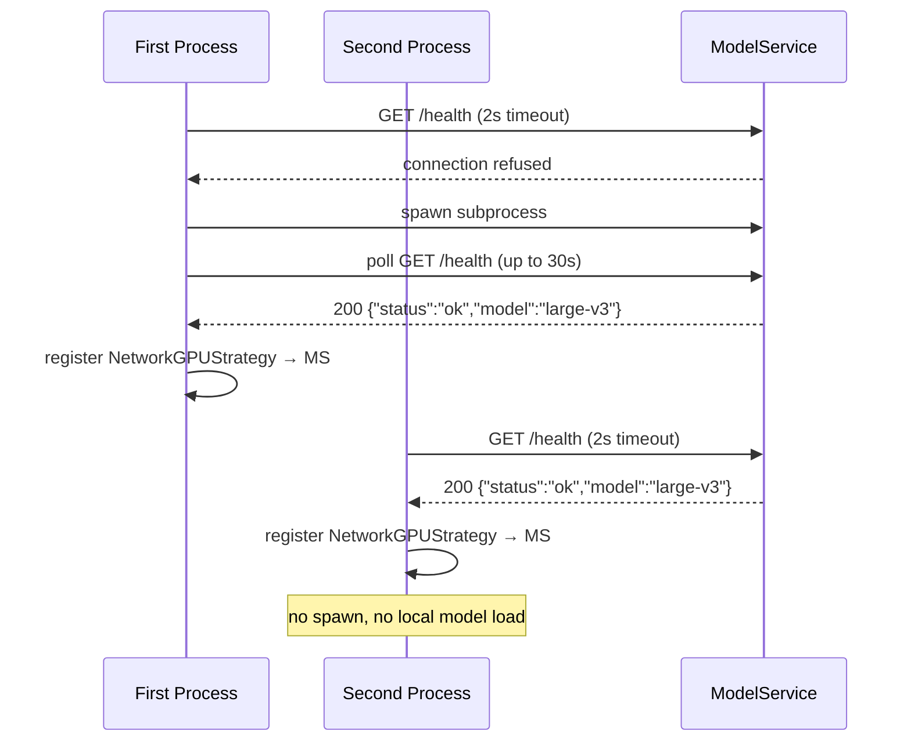

# Design Document: Shared Whisper Model Service

## Overview

This design introduces `model_service.py` — a lightweight FastAPI subprocess that owns the Whisper model and serves `/health` and `/transcribe` on `localhost:8766`. Both the App (`AudioToChat.py`) and the Server (`transcription_server.py`) use a **spawn-or-connect** protocol at startup: whichever process starts first spawns ModelService; the second simply connects to the already-running instance. This eliminates the duplicate VRAM load (3–6 GB for large-v3) that currently occurs when both processes run on the same GPU machine.

If ModelService cannot be started or is misconfigured, both processes fall back transparently to their existing behavior (App loads `LocalGPUStrategy`; Server loads `WhisperModel` directly).

### Key Design Decisions

- **No proxy mode, no bidirectional probing.** The App and Server never probe each other. ModelService is the single source of truth.
- **Spawn-or-connect is stateless.** Each process independently probes `localhost:8766/health`. No shared lock file or IPC is needed.
- **Fallback is silent.** If ModelService is unavailable, both processes degrade gracefully with no user-visible change beyond log output.
- **ModelService is a thin wrapper.** It reuses the same `process_whisper_segments` / `apply_hallucination_filter` helpers already in `transcription_strategies.py`, keeping logic DRY.

---

## Architecture

```mermaid
graph TD
    subgraph "Process A: App (AudioToChat)"
        A1[initialize_transcription_manager] --> A2{HealthProbe\nlocalhost:8766}
        A2 -->|200 + compatible| A3[NetworkGPUStrategy\n→ ModelService]
        A2 -->|fail / mismatch| A4[Spawn ModelService\nas subprocess]
        A4 -->|healthy| A3
        A4 -->|timeout / error| A5[LocalGPUStrategy\nfallback]
    end

    subgraph "Process B: Server (transcription_server.py)"
        B1[startup] --> B2{HealthProbe\nlocalhost:8766}
        B2 -->|200 + compatible| B3[Forward /transcribe\n→ ModelService]
        B2 -->|fail / mismatch| B4[Spawn ModelService\nas subprocess]
        B4 -->|healthy| B3
        B4 -->|timeout / error| B5[Load WhisperModel\ndirectly]
    end

    subgraph "ModelService (model_service.py)"
        MS1[/health] 
        MS2[/transcribe]
        MS3[WhisperModel\nin-process]
        MS2 --> MS3
    end

    A3 -->|HTTP POST| MS2
    B3 -->|HTTP POST| MS2
```

### Spawn-or-Connect Flow



---

## Components and Interfaces

### 1. `model_service.py` (new file)

A standalone FastAPI application, structurally identical to `transcription_server.py` but bound to `MODEL_SERVICE_PORT` (default 8766).

**CLI interface:**
```
python model_service.py [--port PORT] [--model MODEL] [--api-key KEY]
```

**HTTP endpoints:**

| Method | Path | Auth | Description |
|--------|------|------|-------------|
| GET | `/health` | none | Returns `{"status":"ok","model":"<name>"}` when ready |
| POST | `/transcribe` | optional Bearer | Accepts raw WAV bytes, returns `{"text":"...","processing_time":<s>}` |

**Startup behavior:**
- Loads `WhisperModel` at startup; exits with non-zero code on failure.
- Reuses `process_whisper_segments` and `apply_hallucination_filter` from `transcription_strategies.py`.

#### Concurrency Model

The Whisper model is not thread-safe and transcription is a blocking GPU operation. To handle simultaneous requests from the App and the Server without rejecting either, `model_service.py` uses a single `asyncio.Semaphore(1)` as a mutex around the model call.

- The `/transcribe` endpoint acquires the semaphore before calling `model.transcribe()` and releases it after.
- Incoming requests that arrive while the semaphore is held are queued by uvicorn's connection/request queue — they wait, they are **not** rejected.
- `run_in_executor` is used to run the blocking `model.transcribe()` call in a thread pool, so the asyncio event loop remains free to accept new connections while transcription is in progress.
- No additional infrastructure (Redis, task queue, worker pool) is needed — the semaphore is sufficient for the expected concurrency level (2 clients max).
- The client-side timeout (`NETWORK_GPU_TIMEOUT` in `config.py`, currently 30 s) must be set high enough to cover queue wait time plus transcription time. With two concurrent clients, worst-case wait is 2× a single transcription (typically 1–3 s for audio segments), so the default 30 s timeout is sufficient.

```python
_transcribe_lock = asyncio.Semaphore(1)

@app.post("/transcribe")
async def transcribe(request: Request):
    audio_bytes = await request.body()
    async with _transcribe_lock:
        # run blocking transcription in thread pool to avoid blocking event loop
        result = await asyncio.get_event_loop().run_in_executor(
            None, _do_transcribe, audio_bytes
        )
    return JSONResponse(result)
```

### 2. `model_service_manager.py` (new file)

Encapsulates the spawn-or-connect logic so it can be called identically from both the App and the Server.

```python
class ModelServiceManager:
    def probe(self) -> HealthProbeResult
    def spawn(self) -> subprocess.Popen | None
    def wait_until_healthy(self, proc, timeout: float) -> bool
    def ensure_running(self) -> ModelServiceResult
    # ModelServiceResult: url, compatible, spawned, pid
    def shutdown(self) -> None  # terminates subprocess if spawned
```

`ensure_running()` is the single entry point called at startup. It returns a `ModelServiceResult` indicating whether ModelService is available and compatible, so the caller can decide which strategy to activate.

### 3. Changes to `transcription.py`

`initialize_transcription_manager()` gains a new early step:

```python
if MODEL_SERVICE_ENABLED and DEFAULT_TRANSCRIPTION_METHOD in ("local", "auto"):
    result = ModelServiceManager().ensure_running()
    if result.compatible:
        # register NetworkGPUStrategy pointing to ModelService URL
        # skip LocalGPUStrategy initialization
    else:
        # proceed with existing LocalGPUStrategy path
```

The `ModelServiceManager` instance is stored on the module so `cleanup_transcription_system()` can call `manager.shutdown()`.

### 4. Changes to `transcription_server.py`

At startup, before loading `WhisperModel`:

```python
if MODEL_SERVICE_ENABLED:
    result = ModelServiceManager().ensure_running()
    if result.compatible:
        # store result.url; forward all /transcribe calls to it
        # update /health response to include mode="model_service"
    else:
        # load WhisperModel directly as before
```

### 5. Changes to `config.py`

Four new settings added:

```python
MODEL_SERVICE_ENABLED = True
MODEL_SERVICE_PORT = 8766
MODEL_SERVICE_STARTUP_TIMEOUT = 30.0
MODEL_SERVICE_API_KEY = None  # Optional Bearer token
```

`MODEL_SERVICE_URL` is derived: `f"http://localhost:{MODEL_SERVICE_PORT}"`.

---

## Data Models

### `HealthProbeResult`

```python
@dataclass
class HealthProbeResult:
    reachable: bool          # True if HTTP 200 received
    model_name: str | None   # value of "model" field, or None
    compatible: bool         # reachable AND model_name == WHISPER_MODEL
```

### `ModelServiceResult`

```python
@dataclass
class ModelServiceResult:
    available: bool          # ModelService is reachable and compatible
    url: str                 # ModelService base URL
    spawned: bool            # True if this process spawned ModelService
    pid: int | None          # PID of spawned subprocess, or None
```

### HTTP Response Schemas

**`GET /health` (ModelService)**
```json
{"status": "ok", "model": "large-v3"}
```

**`POST /transcribe` (ModelService)**
```json
{"text": "transcribed text here", "processing_time": 0.312}
```

**`GET /health` (Server, when using ModelService)**
```json
{
  "status": "ok",
  "model": "large-v3",
  "mode": "model_service",
  "model_service_url": "http://localhost:8766"
}
```

---

## Correctness Properties

*A property is a characteristic or behavior that should hold true across all valid executions of a system — essentially, a formal statement about what the system should do. Properties serve as the bridge between human-readable specifications and machine-verifiable correctness guarantees.*

### Property 1: Health probe round-trip

*For any* running ModelService instance loaded with model `M`, a GET to `/health` must return `{"status": "ok", "model": M}` with HTTP 200.

**Validates: Requirements 1.1, 3.1**

### Property 2: Transcription endpoint accepts arbitrary WAV bytes

*For any* non-empty valid WAV byte sequence, a POST to `/transcribe` must return HTTP 200 with a JSON body containing a `"text"` string and a non-negative `"processing_time"` float.

**Validates: Requirements 1.2**

### Property 3: Auth enforcement on /transcribe

*For any* ModelService instance configured with an API key `K`, a POST to `/transcribe` without a valid `Authorization: Bearer K` header must return HTTP 401, and a POST with the correct header must return HTTP 200.

**Validates: Requirements 1.6**

### Property 4: Spawn-or-connect idempotence

*For any* two processes that independently call `ModelServiceManager.ensure_running()` when ModelService is already healthy, both must receive `spawned=False` and the same `url`, and no new ModelService subprocess must be created.

**Validates: Requirements 2.3**

### Property 5: Model compatibility check

*For any* HealthProbeResult where `model_name` differs from `WHISPER_MODEL`, `ModelServiceManager.ensure_running()` must return `available=False` and the caller must fall back to local model loading.

**Validates: Requirements 3.3, 3.4**

### Property 6: Fallback on spawn failure

*For any* scenario where ModelService fails to become healthy within `MODEL_SERVICE_STARTUP_TIMEOUT`, `ensure_running()` must return `available=False`, and the App must activate `LocalGPUStrategy` (or the Server must load `WhisperModel` directly) without raising an unhandled exception.

**Validates: Requirements 6.1, 6.2**

### Property 7: Feature flag disables all probe/spawn logic

*For any* configuration where `MODEL_SERVICE_ENABLED = False`, neither the App nor the Server must issue any HTTP request to `MODEL_SERVICE_URL` or spawn any subprocess, and both must behave identically to their pre-feature behavior.

**Validates: Requirements 6.5, 8.4**

### Property 8: Lifecycle — spawning parent terminates ModelService on exit

*For any* `ModelServiceManager` instance that spawned a subprocess, calling `shutdown()` must result in the subprocess no longer being alive within 5 seconds.

**Validates: Requirements 7.1, 7.5**

### Property 9: Non-spawning process does not affect ModelService lifecycle

*For any* `ModelServiceManager` instance where `spawned=False`, calling `shutdown()` must be a no-op (ModelService subprocess continues running).

**Validates: Requirements 7.3**

### Property 10: Concurrent request serialization

*For any* two simultaneous POST requests to `/transcribe`, both must eventually receive HTTP 200 responses with valid transcription results. Neither request must be rejected with HTTP 429 or 503 due to concurrent access. The responses may arrive at different times (serialized), but both must complete successfully.

**Validates: Concurrency requirement**

---

## Error Handling

| Failure Scenario | Detection | Response |
|---|---|---|
| ModelService not running at startup | HealthProbe timeout / connection refused | Attempt spawn; fall back to local on failure |
| ModelService model mismatch | `model` field in `/health` ≠ `WHISPER_MODEL` | Log WARNING; fall back to local |
| ModelService spawn timeout | Poll loop exceeds `MODEL_SERVICE_STARTUP_TIMEOUT` | Log WARNING; fall back to local |
| ModelService crashes mid-session | `NetworkGPUStrategy` returns connection error | `TranscriptionManager` falls back to next strategy in chain |
| Server forwarding failure | HTTP 5xx or connection error from ModelService | Server returns HTTP 502; logs WARNING with URL and error |
| Empty WAV payload to ModelService | `len(audio_bytes) == 0` | Return `{"text": "", "processing_time": 0.0}` with HTTP 200 |
| ModelService model load failure at startup | Exception during `WhisperModel(...)` | Log error; `sys.exit(1)` |
| `MODEL_SERVICE_ENABLED = False` | Config check at startup | Skip all probe/spawn logic silently (DEBUG log) |
| Concurrent `/transcribe` requests | `asyncio.Semaphore(1)` | Requests queue; processed serially; no rejection |

All fallback paths preserve the existing behavior of the App and Server — no new failure modes are introduced for end users.

---

## Testing Strategy

### Unit Tests

Focus on specific examples, integration points, and error conditions:

- `ModelServiceManager.probe()` returns correct `HealthProbeResult` for mocked HTTP responses (200 with matching model, 200 with mismatched model, connection error, missing `model` field).
- `ModelServiceManager.ensure_running()` returns `available=False` when probe fails and spawn times out (mock subprocess that never becomes healthy).
- `initialize_transcription_manager()` registers `NetworkGPUStrategy` (not `LocalGPUStrategy`) when `ensure_running()` returns `available=True`.
- `initialize_transcription_manager()` falls back to `LocalGPUStrategy` when `ensure_running()` returns `available=False`.
- Server `/health` response includes `mode="model_service"` and `model_service_url` when using ModelService.
- Server returns HTTP 502 when forwarded request to ModelService fails.
- `MODEL_SERVICE_ENABLED=False` causes zero HTTP calls to ModelService URL.
- Two concurrent POST requests to `/transcribe` both return HTTP 200 (mock the model to return immediately).
- Verify requests are processed serially (second request starts only after first completes) using timing or mock call ordering.

### Property-Based Tests

Use **Hypothesis** (Python) with a minimum of 100 examples per property.

Each test is tagged with a comment in the format:
`# Feature: shared-whisper-model, Property <N>: <property_text>`

**Property 1 — Health probe round-trip**
Generate random model name strings. Start a real (or mocked) ModelService with that model name. Assert that `/health` always returns `{"status": "ok", "model": <name>}`.
`# Feature: shared-whisper-model, Property 1: Health probe round-trip`

**Property 2 — Transcription endpoint accepts arbitrary WAV bytes**
Generate random valid WAV byte sequences (via Hypothesis strategies). POST each to `/transcribe`. Assert HTTP 200, `"text"` is a string, `"processing_time"` ≥ 0.
`# Feature: shared-whisper-model, Property 2: Transcription endpoint accepts arbitrary WAV bytes`

**Property 3 — Auth enforcement on /transcribe**
Generate random API key strings and random (possibly invalid) bearer tokens. Assert that only the exact matching token returns 200; all others return 401.
`# Feature: shared-whisper-model, Property 3: Auth enforcement on /transcribe`

**Property 4 — Spawn-or-connect idempotence**
Generate random port numbers (in test range). Simulate two concurrent `ensure_running()` calls against a pre-running mock service. Assert both return `spawned=False` and identical URLs.
`# Feature: shared-whisper-model, Property 4: Spawn-or-connect idempotence`

**Property 5 — Model compatibility check**
Generate pairs of (service_model_name, configured_model_name). When they differ, assert `ensure_running()` returns `available=False`. When they match, assert `available=True`.
`# Feature: shared-whisper-model, Property 5: Model compatibility check`

**Property 6 — Fallback on spawn failure**
Generate random timeout values (0.1–5.0s). Simulate a ModelService that never becomes healthy. Assert `ensure_running()` always returns `available=False` and no exception is raised.
`# Feature: shared-whisper-model, Property 6: Fallback on spawn failure`

**Property 7 — Feature flag disables all probe/spawn logic**
Generate arbitrary config states with `MODEL_SERVICE_ENABLED=False`. Assert zero HTTP calls are made to `MODEL_SERVICE_URL` and no subprocess is spawned.
`# Feature: shared-whisper-model, Property 7: Feature flag disables all probe/spawn logic`

**Property 8 — Lifecycle: spawning parent terminates ModelService on exit**
Generate random subprocess mock objects. Call `shutdown()`. Assert the subprocess is terminated within 5 seconds.
`# Feature: shared-whisper-model, Property 8: Lifecycle — spawning parent terminates ModelService on exit`

**Property 9 — Non-spawning process does not affect ModelService lifecycle**
Generate `ModelServiceResult` instances with `spawned=False`. Call `shutdown()`. Assert no termination signal is sent to any subprocess.
`# Feature: shared-whisper-model, Property 9: Non-spawning process does not affect ModelService lifecycle`

**Property 10 — Concurrent request serialization**
Generate N concurrent requests (N drawn from 1–5) to a mocked `/transcribe` endpoint. Assert all N requests return HTTP 200 with valid JSON. Assert no request returns 429 or 503.
`# Feature: shared-whisper-model, Property 10: Concurrent request serialization`
